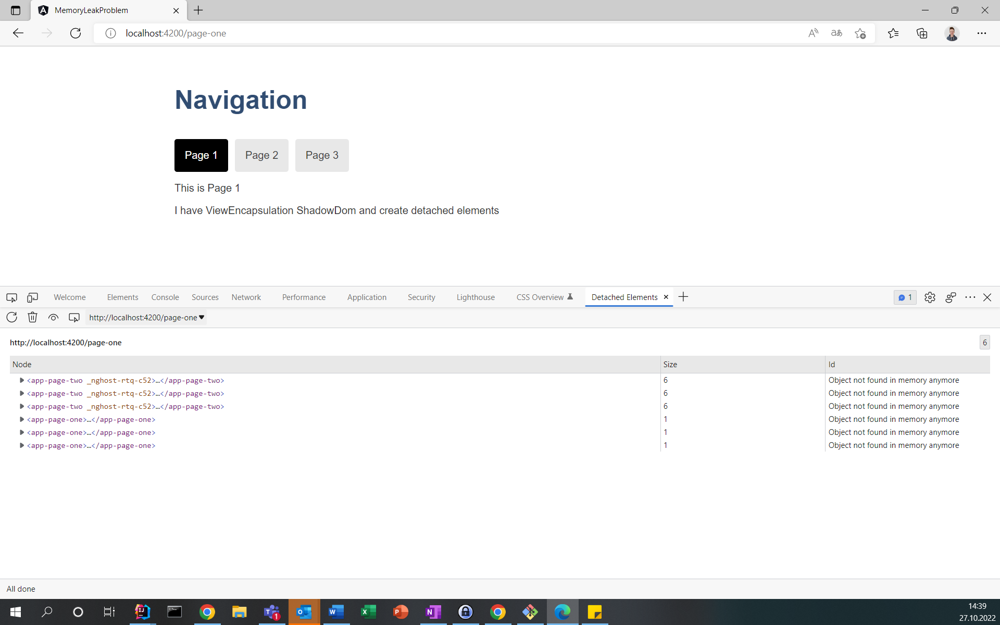

# MemoryLeakProblem

## Summary
This demo application demonstrates a supposed bug in the Angular Browser Animation module, which can lead to a large memory leak 
problem (Angular version 14.2.8). In the issue described below, UI elements that are no longer used are not garbage 
collected when the Angular Browser Animation Module is imported in a multi-page Angular application in connection with 
Angular ShadowDom components. 

## Supposed bug of the Browser Animation module
In multi-page Angular applications which imports the Animation Module, the createRender method of the RenererFactory2 is 
called at every page change (call-stack: createComponent -> componentFactory.create -> rendererFactory.createRenderer) to 
create an animation renderer. This animation renderer contains the various information to be able to run animations.

For each component of a view to be created, the create Renderer method is called and it is checked whether a cutsom 
animation is set for the respective component or not. If this is the case, a custom renderer will be created (that will not 
get cached), otherwise a base renderer should be used. To do this, a delegate is created from the information of the 
respective component (see the next chapter for more information on how the delegate gets created) and it is checked whether 
a renderer has already been cached for such a component. If so, the renderer is returned from the cache, otherwise a new 
base renderer is created and saved.

```typescript
// internal Angular code from the RendererFactory2: 
createRenderer(hostElement, type) {
        const EMPTY_NAMESPACE_ID = '';
        // cache the delegates to find out which cached delegate can
        // be used by which cached renderer
        const delegate = this.delegate.createRenderer(hostElement, type);
        if (!hostElement || !type || !type.data || !type.data['animation']) {
            let renderer = this._rendererCache.get(delegate);
            if (!renderer) {
                renderer = new BaseAnimationRenderer(EMPTY_NAMESPACE_ID, delegate, this.engine);
                // only cache this result when the base renderer is used
                this._rendererCache.set(delegate, renderer);
            }
            return renderer;
        }
        // else custom renderer...
```

As just described, the renderers of the Browser Animation Module are cached so that they can be returned when a previous 
page is called up again. However, the analysis has shown that caching sometimes does not work correctly, and a new renderer 
is always created for some components.

The cache is a simple map that keeps a delegate as a key and the renderer as a value. The delegate is created based on the 
respective component. I noticed in the applications I work on professionally that the components that lead to the 
re-creation of a renderer are themselves relatively small, which is why one could ask why this leads to the large detached 
elements and the memory problem.

The problem is that even a small component like a breadcrumb component holds references to all other components of a view 
through the child and parent node properties. Thus, for example, a table with very large amounts of data will not get 
correctly garbage collected. This is the reason why the browser uses more and more memory by navigating through the 
multi-page application until the application crashes.

## Why does caching sometimes not work correctly?
The problem is in the created delegate, which is used as a key inside the map. The delegate is created via a createRenderer 
method, which in turn iterates through what type of component (what viewEncapsulation) it is to return the correct renderer.

```typescript
// create the delegate
const delegate = this.delegate.createRenderer(hostElement, type);
{code}
{code:java}
// the called createRenderer Method
createRenderer(element: any, type: RendererType2|null): Renderer2 {
  if (!element || !type) {
    return this.defaultRenderer;
  }
  switch (type.encapsulation) {
    case ViewEncapsulation.Emulated: {
      let renderer = this.rendererByCompId.get(type.id);
      if (!renderer) {
        renderer = new EmulatedEncapsulationDomRenderer2(
          this.eventManager, this.sharedStylesHost, type, this.appId);
        this.rendererByCompId.set(type.id, renderer);
      }
      (<EmulatedEncapsulationDomRenderer2>renderer).applyToHost(element);
      return renderer;
    }
    // @ts-ignore TODO: Remove as part of FW-2290. TS complains about us dealing with an enum
    // value that is not known (but previously was the value for ViewEncapsulation.Native)
    case 1:
    case ViewEncapsulation.ShadowDom:
      // TODO(FW-2290): remove the `case 1:` fallback logic and the warning in v12.
      if ((typeof ngDevMode === 'undefined' || ngDevMode) &&
        // @ts-ignore TODO: Remove as part of FW-2290. TS complains about us dealing with an
        // enum value that is not known (but previously was the value for
        // ViewEncapsulation.Native)
        !hasLoggedNativeEncapsulationWarning && type.encapsulation === 1) {
        hasLoggedNativeEncapsulationWarning = true;
        console.warn(
          'ViewEncapsulation.Native is no longer supported. Falling back to ViewEncapsulation.ShadowDom. The fallback will be removed in v12.');
      }

      return new ShadowDomRenderer(this.eventManager, this.sharedStylesHost, element, type);
    default: {
      if (!this.rendererByCompId.has(type.id)) {
        const styles = flattenStyles(type.id, type.styles, []);
        this.sharedStylesHost.addStyles(styles);
        this.rendererByCompId.set(type.id, this.defaultRenderer);
      }
      return this.defaultRenderer;
    }
```

https://github.com/angular/angular/blob/main/packages/platform-browser/src/dom/dom_renderer.ts#L91

In the case of components that are of the ViewEncapsulation ShadowDom type, we have the memory leak problem. In contrast to 
the other cases, the component itself is stored as a property in the renderer, which contains the references to the other 
components of a view.

In addition, a new object of the ShadowDomRenderer to be created is always created here, which also leads to the problem 
that the correct entry in the renderer cache is not found. So instead of using the already created ShadowDomRenderer, a 
new one is cached with every page change.

## Demo to recreate
I have created this small demo in which the problem can be well understood. I recommend using the Microsoft Edge browser for 
this, as it has a dev tool function that can be used to easily filter out the detached elements.

The demo includes three simple pages that can be accessed via buttons. The first page itself uses an Angular component that 
uses ViewEncapsulation ShadowDom. The second page accesses a component with ViewEncapsulation ShadowDom and the third page 
does not use a ShadowDom.

If you switch back and forth between the pages several times, you can see how more and more detached elements are built up 
by the first and second page, while the third page does not produce any detached elements.



This also makes it easy to understand that all UI elements remain on the second page, even though only one child element 
uses the ShadowDom. In addition, this problem also exists even though no animations of the module are actively used at all.

## Monkey Patch
In my work, I'm programming on larger Angular applications that use ShadowDom components and suffer from this memory leak 
problem. I will be very happy when the supposedly incorrect behavior is adjusted in an Angular update.

Until then, I like to share a monkeyPatch with you that you can use to adjust the behavior of RendererFactory2 and its 
cache to prevent the memory leak problem in your applications:

```typescript
export class AppComponent implements OnInit {

  // ...
  constructor(
    // ...
    rendererFactory2: RendererFactory2,
  ) {
    // 😱
    (rendererFactory2 as any)['_rendererCache'] = new WeakMap();
    // ...
  }
```

The weak reference allows the browser's garbage collector to dispose of the object as soon as there is no other reference 
to the object. After a page change, only the renderer cache will reference UI elements that are no longer required (weak) 
and the detached elements will be removed as desired.
